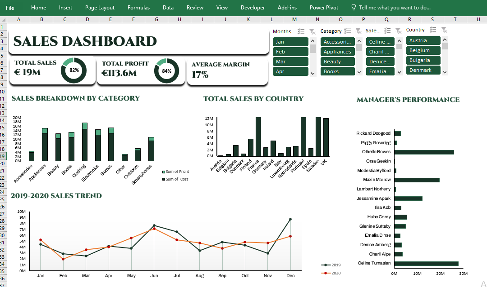

# Sales Dashboard (Excel)

## Project Overview
This project is a sales analysis dashboard created in Microsoft Excel to explore and summarize sales performance using interactive visuals.

## Key Features
- KPIs including Total Sales, Total Profit, and Average Margin
- Interactive dashboard built using Pivot Tables and Slicers
- Sales breakdown by product and category
- Sales performance by country
- Manager-wise sales performance
- Monthly sales trend analysis

## Tools Used
- Microsoft Excel

## Data Source
The dataset used in this project was sourced from Kaggle and is used for learning and practice purposes.  
[Kaggle Sales Dataset](https://www.kaggle.com/datasets/ronnykym/online-store-sales-data)

## Key Insights
- Sales are concentrated in a few key products and categories, while others contribute less overall.
- Certain countries generate higher sales, indicating stronger market performance.
- Manager performance varies noticeably, highlighting differences in sales contribution.
- Sales follow a clear monthly trend, with some periods performing better than others.

## Dashboard Preview
